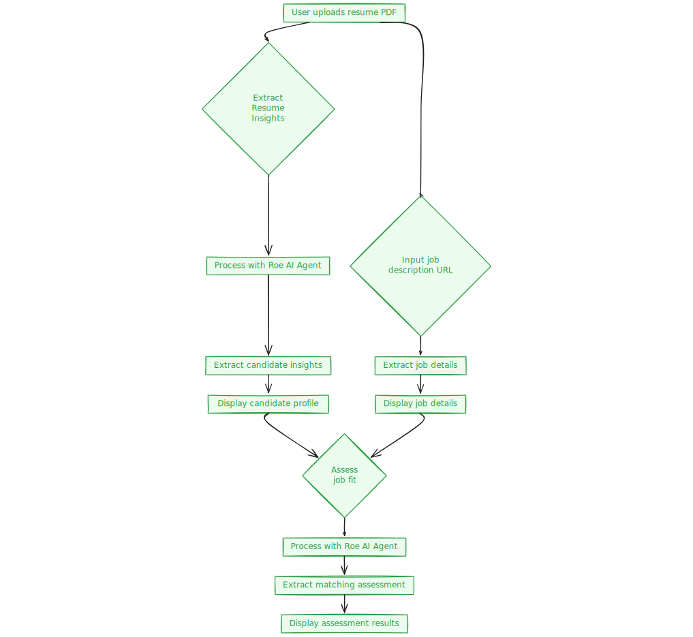
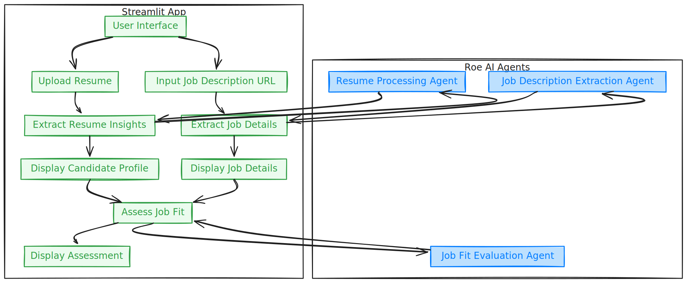

# Resume Intelligence Platform with Roe AI 📋✨



## Unlock the Power of AI in Recruitment! 🚀

Say goodbye to tedious resume screening and hello to efficient hiring with the Resume Intelligence Platform. Leveraging the prowess of multiple [Roe AI agents](https://docs.roe-ai.com/agents/introduction), this Streamlit application streamlines the process of extracting candidate insights, parsing job descriptions, and assessing job fits like never before. 🤖📈

## Why Choose Us? 💼

- **Multi-Agent Magic:** Our platform employs a suite of specialized Roe AI agents, each expert in their domain. From decoding resumes to evaluating job fits, each agent contributes uniquely to provide comprehensive insights. 🧙‍♂️💡

- **Seamless Integration:** With an intuitive Streamlit interface, uploading resumes and extracting job details is a breeze. Get actionable insights in real-time, making informed hiring decisions faster than ever. 🌟💻

- **Accurate Assessments:** Our job fit assessment agent provides detailed analyses, including percentage matches, strengths, and skill gaps, ensuring you find the perfect candidate for the role. 🔍💯

## Getting Started: Your Journey Begins Here 🏁

### Prerequisites

- Python 3.8 or higher 🐍
- Streamlit installed (`pip install streamlit`) 📦
- Roe AI agents configured with appropriate IDs and bearer tokens 🔑

### The Setup Process 🛠️

1. **Clone the Repository**

    ```bash
    git clone https://github.com/luillyfe/resume-intelligence.git
    cd resume-intelligence
    ```

2. **Set Up Environment Variables**

    Create a `.env` file in the root directory and add:

    ```
    ROE_AI_AGENT_ID=your_agent_id
    ROE_AI_BEARER_TOKEN=your_bearer_token
    ROE_AI_JOB_AGENT=your_job_agent_id
    ROE_AI_EVALUATE_AGENT=your_evaluate_agent_id
    ```

3. **Install Dependencies**

    ```bash
    pip install -r requirements.txt
    ```

4. **Launch the Application**

    ```bash
    streamlit run main.py
    ```

    Watch as the magic unfolds, turning raw resumes into valuable insights. ✨👀

## How It Works: The Multi-Agent Approach 🔄

### 1. Resume Insights Extraction

- **Agent in Action:** Our Resume Processing Agent meticulously analyzes uploaded PDF resumes. 📄🔍
- **What It Does:** Extracts critical information such as candidate names, emails, and skills, providing a structured overview of each candidate. 📊📝

### 2. Job Description Extraction

- **Agent in Action:** The Job Description Extraction Agent specializes in parsing job description URLs. 🌐🕵️‍♀️
- **What It Does:** Grabs essential details like key responsibilities and requirements, making it easier to understand job specifications. 📝💡

### 3. Job Fit Assessment

- **Agent in Action:** The Job Fit Evaluation Agent acts as a matchmaking guru. ❤️🔗
- **What It Does:** Compares candidate insights with job details to deliver a percentage match, highlights strengths, and identifies any skill gaps, ensuring the best possible candidate-job fit. 📈💪

## User Guide: Navigating the Platform 🧭

1. **Upload Resume:**
   - Select a resume PDF and upload it via the provided uploader. 📁⬆️
   - Click "Extract Resume Insights" to initiate the analysis and view candidate details. 🔍📊

2. **Extract Job Description:**
   - Input the URL of the job description in the sidebar. ⌚🌐
   - Click "Extract Job Details" to retrieve and display key job requirements. 📝펼치다

3. **Assess Job Fit:**
   - After processing both resume and job description, click "Assess Job Fit" to obtain a detailed matching report. 🤝📊

## Dive Deeper: Application Architecture 🏗️



Our platform is architected around two core components:

- **Streamlit Frontend (`main.py`):**
  - Offers an interactive user interface for uploading resumes, entering job URLs, and viewing insights and assessments. 🎨🌐

- **Roe AI Agent Interaction (`roe_ai.py`):**
  - Manages interactions with Roe AI agents, facilitating resume processing, job description extraction, and job fit evaluations. 🤖DataExchange

## Contribute to the Revolution 🤝

I'm always looking to enhancing existing features or introducing new ones, your contributions can make a difference. So, what are you waiting for? Jump in and help shape the future of hiring! 🚀👥

## License

This project is licensed under the MIT License, encouraging freedom and collaboration in technology. 📜🤝

## Stay Connected

For inquiries, suggestions, or just to say hello, reach out to me at [luillyfe89@gmail.com](mailto:your_email@example.com). We value your input and are here to assist you every step of the way. 📧😊

---

Made with ❤️ by [Fermin Blanco](https://luillyfe.medium.com/)